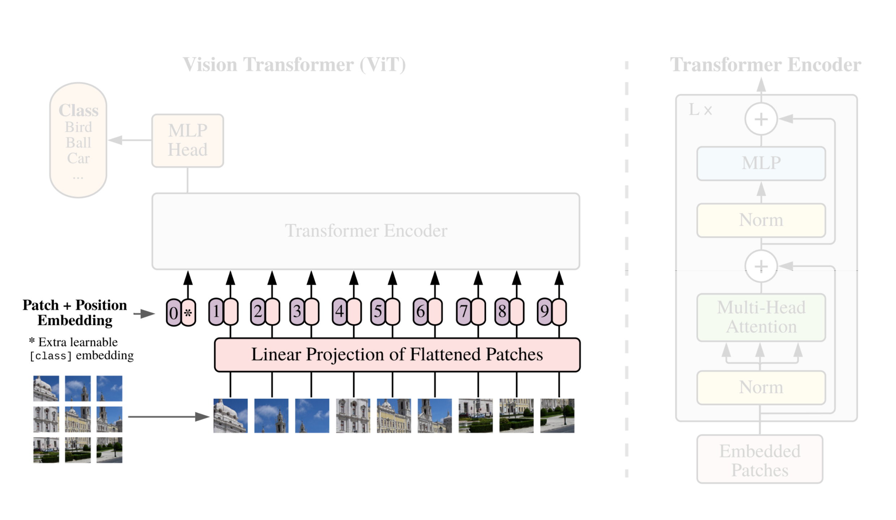
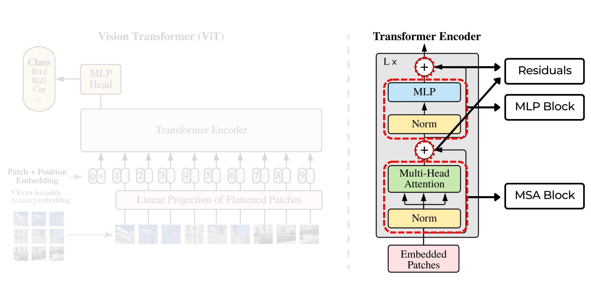
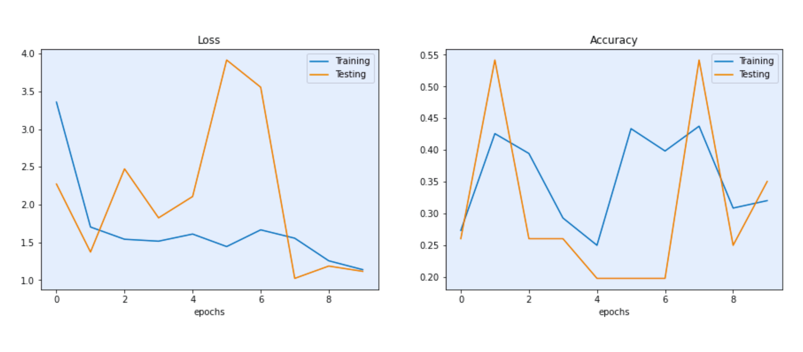
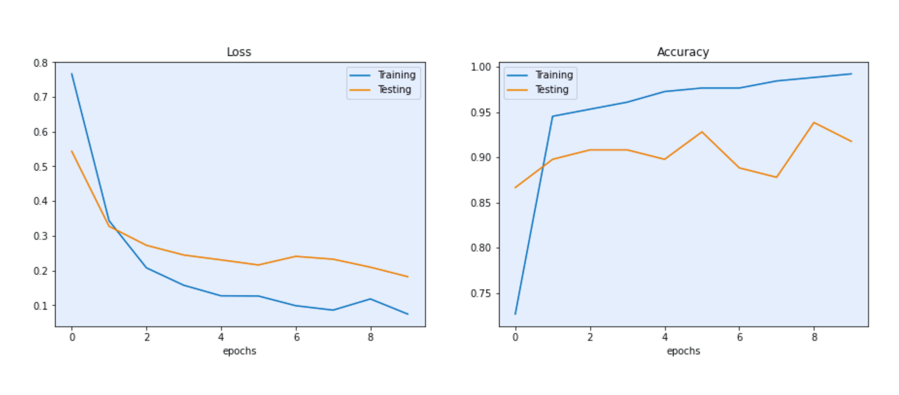

<p align="center">
<a href="https://colab.research.google.com/github/gauravreddy08/pytorch-vision-transformer/blob/main/vit-replication.ipynb" target="_parent"></a><b>&nbsp&nbsp&nbsp</b>
<a href="https://deepnote.com/viewer/github/gauravreddy08/pytorch-vision-transformer/blob/main/vit-replication.ipynb" target="_parent"> </a> </p>

This repo lays out a guide for the unoffcial implementation of the **Vision Transformer (ViT)**, inspired from the paper "*[An Image Is Worth 16X16 Words: Transformers For Image Recognition At Scale](https://arxiv.org/abs/2010.11929)*", in **PyTorch**. Being a considerable *novice* myself, I tried to explain all the math, literature and code in a quite simpler manner. 

> For some reason, GitHub is unable to render the `vit-replication.ipynb` notebook, however, you can directly access it on [**Colab**](https://colab.research.google.com/github/gauravreddy08/pytorch-vision-transformer/blob/main/vit-replication.ipynb) or view it using [**DeepNote**](https://deepnote.com/viewer/github/gauravreddy08/pytorch-vision-transformer/blob/main/vit-replication.ipynb). 

###### Let's get started...

<p align="center"></p>

# Overview

When replicating a paper, we need to take a note of these three things mainly, the **input**, **architecture** of the model, and finally the training and model **hyperparameters** used. Of course, all these details would be sprinkled throughout the entire paper, but in our case, "most" of the details lie behind the **"[Equation 1-4](https://arxiv.org/pdf/2010.11929.pdf#page=4)"**, the **"[Figure 1: Model overview](https://arxiv.org/pdf/2010.11929.pdf#page=3)"** and the **"[Table 1: Details of Vision Transformer model variants](https://arxiv.org/pdf/2010.11929.pdf#page=5)"**

> **Vision Transformer (ViT) paper: [**`An Image Is Worth 16X16 Words`**](https://arxiv.org/abs/2010.11929)**

> **Original Transformer paper: [**`Attention Is All You Need`**](https://arxiv.org/abs/1706.03762)**

> **Dataset Used: [`github.com/mrdbourke/pytorch-deep-learning/pizza_steak_sushi.zip`](https://github.com/mrdbourke/pytorch-deep-learning/blob/main/data/pizza_steak_sushi.zip)**

# 1. Input to the model 



The **ViT architecture** is heavily inspired by the Transformer architecture (hence the name **"Vision Transformer"**). Instead of looking at the data as a whole, these networks focus and give "*attention*" to specific parts of data or an image, in our case. In a **Vision Transformer (ViT)**, the input image is first divided into smaller patches, and each patch is treated like a word in a sentence. The patches are then processed by a *transformer encoder* that's been adapted for image analysis.


So as an initial input through our network, images are resized and cropped into several different **patches**. These patches are then passed through the *transformer encoder* as **1D Tensors**. Also, each patch (image) is coupled with its respective **"positional embedding"**. And there's an extra learnable **"classification token [CLS]"** prepended to the sequence of embeddings.

> **What should be the target size of the input image?**
> 
> The target size of the input image should be 224x224. 
> > Refer table [4](https://arxiv.org/pdf/2010.11929.pdf#page=5).

> **What number of patches are extracted from a image? `3x3`? `5x5`? `10x10`?**
>
> The Base-ViT model, also commonly known as ViT-16, utilizes 16x16 sized patches resulting in a total of 196 patches. 
> > Refer page [5](https://arxiv.org/pdf/2010.11929.pdf#page=5). 
```python
 224*224 / 16**2 -> 196 + 1 (class token) -> 197
```

> **What should the dimension of the then transformed 1D Tensors be?**
> 
> The dimension of the transformed 1D Tensors should be 768. Not so coincidentally, when a patch image (3 x 16 x 16) is flattened and reshaped into a 1D tensor, we end up with a 768 dimension tensor.
>
> ```python
> [16 x 16 x 3] -> nn.Flatten() -> [1 x 768]
> ```
>
> > Refer Table [1](https://arxiv.org/pdf/2010.11929.pdf#page=5).

> **What exact layers are used to generate the image embeddings?**
> 
> ViT uses **Conv2D layers** for both generating embeddings while also dividing the input image into patches. 
>
> You may ask, how can we *patchify* the image using conv layers ? 
>
> The Conv2D layers patchify the image using kernel size and stride. Specifically, setting the `kernel_size` and `stride` to 16, we can parse over the image as 16 by 16 blocks and generate the embeddings. More about this can be found in the code.

> **What's the extra learnable "classification token" mentioned?**
>
> The **Class Token** is randomly initialized and doesn’t contain any useful information on its own. However, the **Class Token** accumulates information from the other tokens in the sequence the deeper and more layers the Transformer is. 

> When the Vision Transformer finally performs the final classification of the sequence, it uses an MLP head which only looks at data from the last layer’s Class Token and no other information. [`source`](https://deepganteam.medium.com/vision-transformers-for-computer-vision-9f70418fe41a)

> **What's a positional embedding?**
> 
> The position of a patch relative to the whole image proves to be crucial information. For example, the whitespace in "the rapist" and "therapist." Transformers, unlike LSTMs, take inputs in parallel and all at once, which means they lose information about the sequence of these patches. To avoid this, we couple each image embedding with its respective positional embedding. [`source`](https://www.youtube.com/watch?v=dichIcUZfOw&ab_channel=HeduAI)

$\mathbf{z}_0=\left[\mathbf{x}_{\text {class }} ; \mathbf{x}_p^1 \mathbf{E} ; \mathbf{x}_p^2 \mathbf{E} ; \cdots ; \mathbf{x}_p^N \mathbf{E}\right]+\mathbf{E}_{p o s}, \quad \mathbf{E} \in \mathbb{R}^{\left(P^2 \cdot C\right) \times D}, \mathbf{E}_{p o s} \in \mathbb{R}^{(N+1) \times D}$

Equation 1 pretty much sums up the whole content above, into a mathematical form. 

But, how about a psuedo code ? 

**Equation 1 Psuedo Code:**
```python
x_input = [class_token, patch_1, patch_2, ..., patch_N] + [pos_0, pos_1, pos_2, ..., pos_N]
```
**Python Code:**
```python
patch_embedding = nn.Conv2d(in_channels=3, out_channels=768, # 16*16*3
                            kernel_size=16, stride=16, padding=0)
```
### The learnable **[CLS] token**

The **[CLS] token** is considered to be unimportant as it does not carry any significant information. Instead, it is initialized as a random number collection. However, it serves as a **placeholder** for data, which is then utilized by the head of the architecture for image classification.

To represent an entire image for classification purposes, a **[CLS] token** is incorporated. Additionally, the authors introduce absolute position embeddings and process the resultant sequence of vectors through a conventional Transformer encoder.

**Python Code:**
```python 
class_token = nn.Parameter(torch.rand(batch_size, 1, 768), 
                           requires_grad=True)
```

### The **Positional Embeddings**

By incorporating **positional embeddings**, the model gains valuable information about the location of each patch which can be used for further analysis. 

> **How are these position embeddings generated ?**
>
> The process of generating positional embeddings is not as straightforward as assigning *sequential numbers* (such as 1, 2, 3, ..., N) to each patch. Instead, a combination of **sine** and **cosine** functions is used to create a series of embeddings that encode the position of each patch. For more information on the specifics of this process. More info [here](https://www.youtube.com/watch?v=dichIcUZfOw&t=478s&ab_channel=HeduAI). 

$$ P E_{(p o s, 2 i)}=\sin \left(p o s / 10000^{2 i / d_{\text {model}}}\right) $$

$$ P E_{(p o s, 2 i+1)}=\cos \left(p o s / 10000^{2 i / d_{\text {model}}}\right) $$

> $d_{\text {model}}$ -> Dimension of the 1D Tensors = `768`
>  
> $pos$ = 1, 2, 3, ..., 197 patches
> 
> $i$ = 1, 2, 3, ..., 768 features

<!-- Generated positional embedding for [196, 768] Tensor: 
```python
(tensor([[ 0.0000e+00,  1.0000e+00,  0.0000e+00,  ...,  1.0000e+00,
           0.0000e+00,  1.0000e+00],
         [ 8.4147e-01,  5.6009e-01,  8.1525e-01,  ...,  1.0000e+00,
           1.0491e-08,  1.0000e+00],
         [ 9.0930e-01, -3.7260e-01,  9.4424e-01,  ...,  1.0000e+00,
           2.0983e-08,  1.0000e+00],
         ...,
         [-9.7846e-01,  9.9758e-01,  9.8436e-01,  ...,  1.0000e+00,
           2.0248e-06,  1.0000e+00],
         [-7.0239e-01,  6.1638e-01,  4.2645e-01,  ...,  1.0000e+00,
           2.0353e-06,  1.0000e+00],
         [ 2.1945e-01, -3.0712e-01, -4.9044e-01,  ...,  1.0000e+00,
           2.0458e-06,  1.0000e+00]]), torch.Size([196, 768]))
``` -->

# **2. The Architecture**



> Remember, every model is made of layers.

> And, every layer comprises of stacked convolution blocks. 

After converting our images into 1D tensors, as explained in the paper, we can now pass these tensors through the **Transformer Encoder**. The encoder comprises multiple layers, each containing two distinct *ConvBlocks* known as the **MSA Block** and the **MLP Block**.

> **How many layers should the encoder contain?**
> 
> **12**. Refer Table [1](https://arxiv.org/pdf/2010.11929.pdf#page=5)

## 2.1. **MultiHead Self-Attention (MSA)** block

This convolutional block comprises of two components, **MSA** and **LayerNorm**, as shown in the equation below.

Assuming $\mathbf{z}\_{\ell-1}$ is passed through the LayerNorm layer first, then through the MSA layer, the resulting output is $\mathbf{z}\_{\ell}^{\prime}$. Additionally, the output is combined with the original input $\mathbf{z}\_{\ell-1}$, which acts as a residual block.

$$\mathbf{z}_{\ell}^{\prime}=\operatorname{MSA}\left(\operatorname{LN}\left(\mathbf{z}_{\ell-1}\right)\right)+\mathbf{z}_{\ell-1}, \quad \ell=1 \ldots L$$

> **What is a MultiHead Self-Attention ?**
> 
> Watch three part series by . [**`1/SelfAttention`**](https://www.youtube.com/watch?v=yGTUuEx3GkA&t=640s&ab_channel=Rasa), [**`2/Keys,Values,Queries`**](https://www.youtube.com/watch?v=tIvKXrEDMhk&ab_channel=Rasa) & [**`3/MultiHeadAttention`**](https://www.youtube.com/watch?v=23XUv0T9L5c&ab_channel=Rasa)

> **What is the purpose of adding initial inputs back again ?**
> 
> This is known as Residual blocks. This method is used in a very popular model, guess which one? **ResNets!!**
> 
> Watch [**`ResNet (actually) explained in under 10 minutes`**](https://www.youtube.com/watch?v=o_3mboe1jYI&ab_channel=rupertai)
> 
> Also, [**`Vanishing & Exploding Gradient explained`**](https://www.youtube.com/watch?v=qO_NLVjD6zE&ab_channel=deeplizard)

**Equation 2 Psuedo Code :**
```python
msa_output = MSA(x_input) + x_input
```

**Python Code:**
```python
class MultiHeadSelfAttention(nn.Module):
  def __init__(self,
               embedding_dim: int = 768,
               num_heads : int = 12,
               attn_dropout : int = 0):
    super().__init__()

    self.layer_norm = nn.LayerNorm(normalized_shape=embedding_dim)

    self.multi_attn = nn.MultiheadAttention(
        embed_dim = embedding_dim,
        num_heads = num_heads, batch_first = True) # batch_first -> (batch, seq, features) -> (32, 197, 768)

  def forward(self, x):
        x = self.layer_norm(x)
        attn_output, _ = self.multi_attn(query=x, key=x,value=x, 
                                         need_weights=False) 
        return attn_output    
```

## 2.2. **MultiLayer Perceptron (MLP)** block

Although the term **"perceptron"** may seem complex, it is actually a very simple concept that you may already be familiar with. Let's break it down *word* by *word*. The word **"perceptron"** refers to a **neuron**, which in the context of artificial intelligence (AI), is simply a **dense layer**. In PyTorch, a **dense layer** is represented by the **`nn.Linear` layer**. A **"multi-layered"** perceptron simply means stacking multiple **`nn.Linear` layers** on top of each other. It's important to note that activation functions such as **GeLU** and **Dropout layers** are added in between these **`nn.Linear` layers**.

Similar to the previous block, this block follows the same pipeline by adding the initial input to the output produced by the **MLP block**, which acts as a residual block.

$$\mathbf{z}_{\ell}=\operatorname{MLP}\left(\operatorname{LN}\left(\mathbf{z}_{\ell}^{\prime}\right)\right)+\mathbf{z}_{\ell}^{\prime}, \quad \ell=1 \ldots L$$

> **Why do we add Dropout layers ?**
> 
> **Reason 1:** Cause the paper says so. Refer section [ ***B.1 Training***](https://arxiv.org/pdf/2010.11929.pdf#page=13)
>
> >  "*Dropout, when used, is applied after every dense layer except forthe qkv-projections and directly after adding positional to patch embeddings*"
>
> **Reason 2:** Dropout layers are a regularization technique used in neural networks to prevent overfitting. Overfitting occurs when a neural network becomes too complex and is too closely fit to the training data, resulting in poor performance when applied to new, unseen data.

> **What does GeLU activation do ?**
> 
> **GeLU** stands for **Gaussian Error Linear Units**. It is an activation function that was proposed as an alternative to other commonly used activation functions, such as **ReLU (Rectified Linear Unit)** and **Sigmoid** functions.
>
> The **GeLU** activation function is a smooth function that is similar to the **Sigmoid** function, but with some advantages. It is a continuous, differentiable, and monotonic function that can be efficiently computed.

**Equation 3 Psuedo Code :**
```python
mlp_output = MLP(msa_output) + msa_output
```

**Python Code:**
```python
class MLPBlock(nn.Module):
    def __init__(self,
                 embedding_dim:int=768, # Hidden Size D from Table 1 for ViT-Base
                 mlp_size:int=3072, # MLP size from Table 1 for ViT-Base
                 dropout:float=0.1): # Dropout from Table 3 for ViT-Base
        super().__init__()
      
        self.layer_norm = nn.LayerNorm(normalized_shape=embedding_dim)
        
        self.mlp = nn.Sequential(
            nn.Linear(in_features=embedding_dim,
                      out_features=mlp_size),
            nn.GELU(), # "The MLP contains two layers with a GELU non-linearity (section 3.1)."
            nn.Dropout(p=dropout),
            nn.Linear(in_features=mlp_size,
                      out_features=embedding_dim), 
            nn.Dropout(p=dropout) # "Dropout, when used, is applied after every dense layer.."
        )
        
    def forward(self, x):
        x = self.layer_norm(x)
        x = self.mlp(x)
        return x
```
### Final Model Architecture: 
###### Refer [**`vit-replication.ipynb`**](https://colab.research.google.com/github/gauravreddy08/pytorch-vision-transformer/blob/main/vit-replication.ipynb) for detailed replication info
```
===================================================================================================================
Layer (type (var_name))                                 Input Shape          Output Shape         Trainable
===================================================================================================================
ViT (ViT)                                               [32, 3, 224, 224]    [32, 3]              True
├─PatchEmbedding (patch_embedding)                      [32, 3, 224, 224]    [32, 197, 768]       True
│    └─Sequential (patch_embedding)                     [32, 3, 224, 224]    [32, 768, 196]       True
│    │    └─Conv2d (0)                                  [32, 3, 224, 224]    [32, 768, 14, 14]    True
│    │    └─Flatten (1)                                 [32, 768, 14, 14]    [32, 768, 196]       --
├─Sequential (encoder)                                  [32, 197, 768]       [32, 197, 768]       True
│    └─TransformerEncoderBlock (0)                      [32, 197, 768]       [32, 197, 768]       True
│    │    └─MultiHeadSelfAttention (msa_block)          [32, 197, 768]       [32, 197, 768]       True
│    │    └─MLPBlock (mlp_block)                        [32, 197, 768]       [32, 197, 768]       True
│    └─TransformerEncoderBlock (1)                      [32, 197, 768]       [32, 197, 768]       True
│    │    └─MultiHeadSelfAttention (msa_block)          [32, 197, 768]       [32, 197, 768]       True
│    │    └─MLPBlock (mlp_block)                        [32, 197, 768]       [32, 197, 768]       True
│    └─TransformerEncoderBlock (2)                      [32, 197, 768]       [32, 197, 768]       True
│    │    └─MultiHeadSelfAttention (msa_block)          [32, 197, 768]       [32, 197, 768]       True
│    │    └─MLPBlock (mlp_block)                        [32, 197, 768]       [32, 197, 768]       True
│    └─TransformerEncoderBlock (3)                      [32, 197, 768]       [32, 197, 768]       True
│    │    └─MultiHeadSelfAttention (msa_block)          [32, 197, 768]       [32, 197, 768]       True
│    │    └─MLPBlock (mlp_block)                        [32, 197, 768]       [32, 197, 768]       True
│    └─TransformerEncoderBlock (4)                      [32, 197, 768]       [32, 197, 768]       True
│    │    └─MultiHeadSelfAttention (msa_block)          [32, 197, 768]       [32, 197, 768]       True
│    │    └─MLPBlock (mlp_block)                        [32, 197, 768]       [32, 197, 768]       True
│    └─TransformerEncoderBlock (5)                      [32, 197, 768]       [32, 197, 768]       True
│    │    └─MultiHeadSelfAttention (msa_block)          [32, 197, 768]       [32, 197, 768]       True
│    │    └─MLPBlock (mlp_block)                        [32, 197, 768]       [32, 197, 768]       True
│    └─TransformerEncoderBlock (6)                      [32, 197, 768]       [32, 197, 768]       True
│    │    └─MultiHeadSelfAttention (msa_block)          [32, 197, 768]       [32, 197, 768]       True
│    │    └─MLPBlock (mlp_block)                        [32, 197, 768]       [32, 197, 768]       True
│    └─TransformerEncoderBlock (7)                      [32, 197, 768]       [32, 197, 768]       True
│    │    └─MultiHeadSelfAttention (msa_block)          [32, 197, 768]       [32, 197, 768]       True
│    │    └─MLPBlock (mlp_block)                        [32, 197, 768]       [32, 197, 768]       True
│    └─TransformerEncoderBlock (8)                      [32, 197, 768]       [32, 197, 768]       True
│    │    └─MultiHeadSelfAttention (msa_block)          [32, 197, 768]       [32, 197, 768]       True
│    │    └─MLPBlock (mlp_block)                        [32, 197, 768]       [32, 197, 768]       True
│    └─TransformerEncoderBlock (9)                      [32, 197, 768]       [32, 197, 768]       True
│    │    └─MultiHeadSelfAttention (msa_block)          [32, 197, 768]       [32, 197, 768]       True
│    │    └─MLPBlock (mlp_block)                        [32, 197, 768]       [32, 197, 768]       True
│    └─TransformerEncoderBlock (10)                     [32, 197, 768]       [32, 197, 768]       True
│    │    └─MultiHeadSelfAttention (msa_block)          [32, 197, 768]       [32, 197, 768]       True
│    │    └─MLPBlock (mlp_block)                        [32, 197, 768]       [32, 197, 768]       True
│    └─TransformerEncoderBlock (11)                     [32, 197, 768]       [32, 197, 768]       True
│    │    └─MultiHeadSelfAttention (msa_block)          [32, 197, 768]       [32, 197, 768]       True
│    │    └─MLPBlock (mlp_block)                        [32, 197, 768]       [32, 197, 768]       True
├─Sequential (classifier)                               [32, 768]            [32, 3]              True
│    └─LayerNorm (0)                                    [32, 768]            [32, 768]            True
│    └─Linear (1)                                       [32, 768]            [32, 3]              True
===================================================================================================================
Total params: 85,648,899
Trainable params: 85,648,899
Non-trainable params: 0
===================================================================================================================
```

# 3. HyperParameters
### `Loss`: *Categorical Cross Entropy*

```python
loss_fn = torch.nn.CrossEntropyLoss()
```

### `Optimizer`: *Adam*

> *We train all models, including ResNets, using Adam (Kingma & Ba, 2015) with β1 = 0.9, β2 = 0.999, a batch size of 4096 and apply a high weight decay of 0.1...* **- [Page 5, Training & Fine-tuning](https://arxiv.org/pdf/2010.11929.pdf#page=5)**

```python
optimizer = torch.optim.Adam(params=vit.parameters(), lr=1e-3,
                             betas=(0.9, 0.999), weight_decay=0.1)
```

# 4. Results 
### "Our" ViT model results 


The model works! But why isn't performing well? 

ViT is meant to be competing with *state-of-the-art* models right? Well, let's test with a pretrain ViT model...

---

### "Pretrained" ViT model results 


> Well, this model seems to work well. Where did we go wrong?

These results are likely because of the difference in data resources and training regime of our ViT model versus the ViT paper. 

Our model fails to perform well cause of multiple reasons, few major ones are: 

1. **`Insufficient Data` :** Our dataset contains only few hundreds of images, while the pretrained model is trained on ImageNet dataset, which containes over 14,197,122 images. 
2. **`Computational Limitations` :** The pretrained model from the paper, is trained for 7 epochs with a batch size of 4096, while ours was for 5 epochs and only 32 batch size

Apart from these, the research team had plethora of resources, money and most importantly time. They worked on this model for days, weeks, months and even year presumably, trying and tweaking several hyper-parameters to achieve the best weights as possible. 

As of February 2023, the price for renting a TPUv4 (Tensor Processing Unit version 4) with 8 cores on Google Cloud is **$12.88** per hour. To rent one for 30 straight days would cost **$5,924 USD per month**.

This cost (monetary and time) may be viable for some *larger research teams* or enterprises but for many people it's not.

So having a pretrained model available through resources like `torchvision.models`, the **timm (Torch Image Models)** library, the **HuggingFace Hub** or even from the authors of the papers themselves (there's a growing trend for machine learning researchers to release the code and pretrained models from their research papers, I'm a big fan of this trend, many of these resources can be found on [**Paperswithcode.com**](https://paperswithcode.com/)).

> If you're focused on leveraging the benefits of a specific model architecture rather than creating your custom architecture, I'd highly recommend using a pretrained model.
